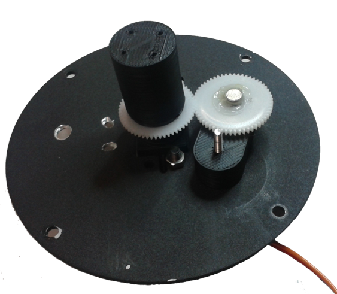
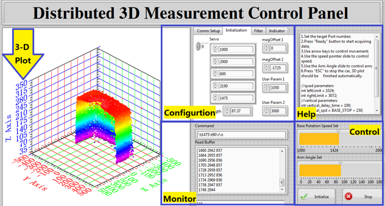

Distributed3D
=============

A distributed 3d laser measurement system for 3D interior contour mapping.

Advantages over centralized solutions

* Compact, low cost subsystem is easier to replace and maintain should one fail;
* Easier to expand the overall range of measurement simply by adding more slave units;
* Less processing workload on the central system processor, raw data can be pre-processed locally from the slave unit then only send the key values to the central system.

Slave Unit
---

An event-driven primitive soft RTOS is implemented in order to maintain responsiveness to the master's command while continiously measuring and tranmitting point cloud and miscellaneous data.

Each point measured in the  laser  CS is then represented in the  ground  CS by the orthogonal following transformation,

CS Defination | Prototype | non-Contact Encoder
---|---|---
 |  | 

2 non-contact (to avoid kinematic singularities) magnetic encoders and a laser rangefinder are responsible for taking 2 angular coords and 1 distance coords in the spherical laser CS. The spherical coords are converted into orthogonal coords locally on the slave unit.

Master Panel
---

Configs the constants for the slave units and command the measurement strategy. A GUI enables the direct monitor of measurement process as well as real-time adjustment.

Measurement Strategies
---

What makes a good strategy for a distributed measurement system?

None, in order to fully expliot the potential of a distributed measurement system, no one strategy is good enough to be a one-hit wonder. It has to be as much versatile as possible and always ready to shift. This also helps solve the problem of potential overlapping(waste of resources) or overlooking(incomplete point cloud).

Here are a few show cases of how versatile the slave unit can be. Thanks to the singularity-free scanning kinamatics and soft RTOS implemented, the measurement unit is able to:

* Provide data as a series of point cloud in any specific range within the hemispherical workspace
* Respond to the master command in real-time to adjust measurement strategy.

Spiral | Vertical
---|---
 | 

Manual | Partial
--- | ---
 | 

BOM
---
    n   Arduino DUE Board
    2*n AS5045 magnetic encoder
    2*n USR-WIFI232-T wifi module
    n   GP3D03-ZZ4-COM laser distance sensor
    n   2-DOF cloud deck
    2*n servo
    2*n Li-Po battery
    1   wireless router

    n : number of units

Runtime environment

---
    NI LabVIEW 2013 runtime engine

License
---

    Distributed3D (both software and hardware drawings) is a free release under GPL v2.
