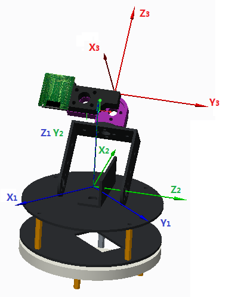
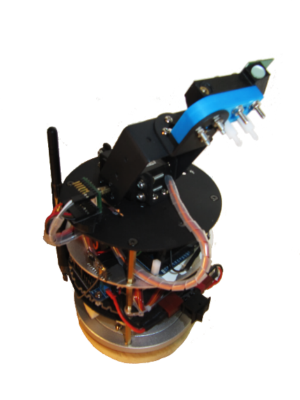
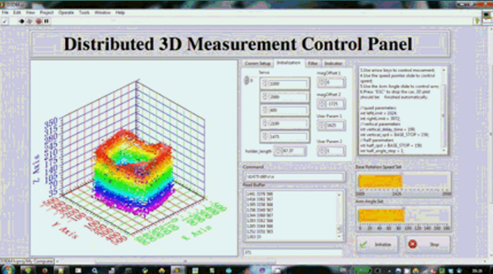

Distributed3D
=============

A distributed 3d laser scanner system

BOM
---

    n   Arduino DUE Board
    2*n AS5045 magnetic encoder
    2*n USR-WIFI232-T wifi module
    n   GP3D03-ZZ4-COM laser distance sensor
    n   2-DOF cloud deck
    2*n servo
    2*n Li-Po battery
    1   wireless router
    
    *n : number of units

Measurement Setup
---

Assembly
---

GUI
---

Runtime environment
---

    Arduino IDE 1.5.6
    NI LabVIEW 2013 runtime engine
    
License
---

    Distributed3D (both software and hardware drawings) is a free release under GPL v2.
